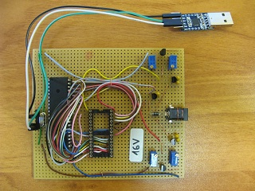
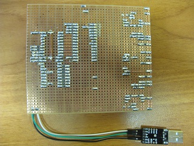
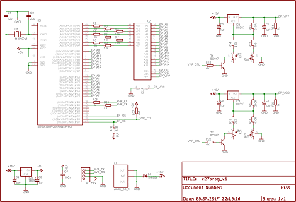

### EPROM programmer

I needed an EPROM programmer to try the [ATA Security eXtension BIOS](http://www.fitzenreiter.de/ata/ata_eng.htm).
I ordered one from eBay, but it didn't work, so I designed my own.

The programmer is not really ment to be universal. It uses 16 address pins, however pin multiplexing
(OE/Vpp) is not supported, so the largest EPROM it can do without modifications is the 27C256.

I had an ATmega324 lying around so I used that, but any MCU with 27 free I/O pins, USART, 512 bytes of RAM and 4k
bytes of flash should work.

The firmware implements the Presto II algorithm described in the ST's M27C256B datasheet (a sequence of 100us
program pulses to each byte until a correct verify occurs).

Communication with the programmer is done over the serial interface and to automate the typical
operations I wrote 4 python scripts:

script      | purpose
------------|--------
e27blank.py | checks if the chip is blank
e27rd.py    | reads the chip's contents into a file
e27vrf.py   | verifies the chip's contents against a file
e27wr.py    | programs the chip

The scrips use binary files as input so you might need a tool like hex2bin.

####Hardware

The M27C256B datasheet states that during programming, not only Vpp but also Vcc must be higher than normal.

Operation   | Vcc   | Vpp
------------|-------|----
Normal      | 5.0V  | 5.0V
Programming | 6.25V | 12.75V

Therefore there are two LM317 regulators. One provides voltage to the EPROM's Vcc pin and the other to Vpp.
Each regulator provides 2 different voltages. This is accomplished by a transistor, switching a resistor in
or out of the regulator's adjust network. All 4 voltages are set with 4 potentiometers. The programmer needs
about 16V to have enough headroom for the voltage drop on LM317 and input protection diode.

**Before using the programmer, perform the following procedure without having an EPROM chip in the socket:**

1. Issue AT+E27VPP=1 command to the MCU
5. Trim R1 until Vpp is 12.75V
6. Trim R20 until Vcc is 6.25V
4. Issue AT+E27VPP=0 command to the MCU
2. Trim R15 until Vpp is 5.0V
3. Trim R21 until Vcc is 5.0V
7. Repeat steps 1 to 6 and verify the voltages

The AT+E27VPP command is used exclusively for this voltage calibration. During normal operation, the MCU
will control the programming voltage automatically.

**Do not use larger than 1uF caps on the outputs of both LM317s.** Doing so will extend the rise/fall times
when switching voltages between programming/normal operations. With 1uF, these times are around 200us. The
programmer firmware uses 1ms delay after switching operations to allow for some headroom. If you have a DSO,
you can use it to measure the rise and fall times. The fall times will be significantly longer than rise times
since linear voltage regulators can only source current, not sink it. To help with sinking, there's a 1k ohm
resistor on the outputs of both LM317s connected directly to GND.

To compile the sources my AVR library is required.
